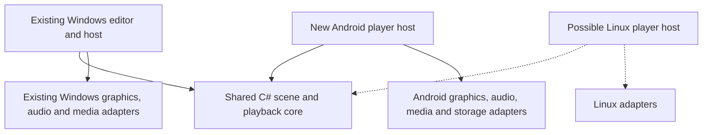

# Android Player Plan

Status: planning proposal, September 12, 2026. No Android application, shared runtime extraction, device qualification, or performance benchmark has been implemented by this planning pass.

The intended first use is **unattended playback on an Android projector or TV**, with projects authored in the Windows editor. This complements the [Outdoor ARM Player Plan](Outdoor-ARM-Player-Plan.md); Android is another possible host for the same portable player contract, not a commitment to replace the Linux proposal. Its outdoor power, optical, and weatherproofing questions remain separate and unresolved.

## Recommendation

Build a separate Android player in this repository and extract shared C# code incrementally. Keep the existing WPF editor and Direct3D backend. First qualify one actual device and one representative reactive scene; defer broad Android compatibility, a mobile editor, and a public store release.

The proposed starting stack is **.NET for Android with a native fullscreen activity, an OpenGL ES 3.1 renderer, hardware video decoding, and Android audio input**. This preserves the language and offers a path to reuse simulation, scene, scheduling, and audio-analysis logic. .NET for Android supports writing Android apps in .NET languages and accessing Android libraries through bindings. [Microsoft documentation](https://learn.microsoft.com/en-us/dotnet/android/), [Java library bindings](https://learn.microsoft.com/en-us/dotnet/android/binding-libs/binding-java-libs/).

This is a provisional engineering choice, subject to the graphics/media/device spike below. A cross-platform UI framework is unnecessary for the small appliance interface; moving the Windows editor to MAUI would add a separate migration without removing the need to port its rendering and media integration. A Kotlin player is an alternative if .NET integration proves troublesome, but would reduce direct C# reuse. A new C++/Vulkan engine would offer another portability route at a substantially larger implementation scope. Do not select either rewrite before measuring the smaller approach.

## What the codebase actually looks like

| Area | Evidence in this repository | Android consequence |
| --- | --- | --- |
| Build and UI | `lifeviz.csproj` targets `net9.0-windows`, enables WPF, compiles shaders with Windows SDK `fxc.exe`, and bundles `ffmpeg.exe` using PowerShell. | Add a separate Android project/build. Changing the target framework on the current app is insufficient. |
| CPU simulation | `GameOfLifeEngine.cs` uses ordinary .NET collections/tasks; `SimulationReactivity.cs` defines mapping data and helpers. | Strong extraction candidates and useful reference behavior. Mobile throughput is unmeasured. |
| Scene data | `LayerConfigFile.cs` has versioned JSON data, but also editor conversion methods and dependencies on editor models/default assets. `SceneFileStore.cs` separates persistence from WPF. | Separate the scene contract/migrations from editor adapters; validate storage replacement/recovery semantics on Android. |
| Asset paths | `DefaultScene.PortableMediaPath` special-cases the bundled starter asset. Ordinary files are not automatically bundled. | Existing JSON export alone is not a portable player package. Resolve all media through package-relative asset identities. |
| Playback orchestration | Source state, timing, simulation groups, compositing, and rendering live in `MainWindow.xaml.cs` and its partial classes. | This is the largest coupling problem. Move behavior into a runtime a piece at a time, with the desktop consuming each extracted piece. |
| Renderer abstractions | `IRenderBackend` is private inside `MainWindow`; its methods use nested runtime types. `IGpuSimulationSurfaceBackend` exposes `GpuCompositeSurface` and shared texture handles. | Existing interfaces are useful design evidence but are not portable renderer contracts. |
| GPU processing | `GpuSharedDevice.cs`, `GpuSimulationBackend.cs`, the compositors, and presentation use Direct3D11/Vortice/WPF. HLSL includes compute, integer textures, texture arrays, and ping-pong history. | New graphics backend and shader port. Preserve algorithms and tested behavior; Windows shader binaries and surface sharing cannot be reused directly. |
| Audio | `AudioBeatDetector.cs` mixes WinRT/WASAPI capture with analysis, but already accepts external/offline PCM samples. | Extract the PCM analyzer, then feed it Android audio samples. Capture/device selection are new adapters. |
| Files and video | `FileCaptureService.cs` combines scheduling, FFmpeg processes, WPF imaging, NAudio, and online media support. `FfmpegProcessManager.cs` uses Windows process management. | Reuse scheduling concepts after separation; replace decode/output/process plumbing. |
| Desktop-only workflows | Window capture, WinRT webcams, Media Foundation recording, bake workers, and ClickOnce installation. | Keep on Windows initially. They are not prerequisites for an unattended scene player. |

## Proposed boundaries

These names describe future responsibilities, not projects that exist today. Start with a small number of projects; split further only when dependencies justify it.

- **Shared core:** scene data/migrations, capability validation, asset references, CPU reference simulation, PCM analysis, reactive mappings, animation/AutoClip scheduling, and playback state as extraction progresses.
- **Host boundary:** explicit clock, audio samples, decoded-frame availability, package storage, and playback commands. Avoid WPF objects, Android contexts, device paths, and platform handles in the shared contract.
- **Renderer boundary:** scene operations and backend-owned frame resources with explicit ownership, lifetime, dimensions, and synchronization. Keep GPU work on textures; a portable interface must not force every frame through `byte[]`. Desktop shared-D3D handles remain private to the Windows adapter.
- **Android host:** fullscreen surface, lifecycle/context recreation, D-pad setup controls, permission handling, package import, native decode/audio, and device-specific kiosk provisioning.

The Linux and Android versions could share core logic and GLES shader source. EGL setup, video decode, audio devices, storage permissions, and startup still need different adapters. Do not assume that choosing GLES makes the entire player portable.

Avoid a second permanent copy of the playback engine and widespread `#if ANDROID` branches inside `MainWindow`. Preserve existing JSON meanings and Windows defaults. Unsupported Android settings should produce a compatibility report, not silently alter the authored scene.

There is also a repository layout trap: the current SDK project sits at the repository root and uses default item discovery. When adding nested projects, explicitly exclude their source/resources from the desktop project, or move the desktop project in a separately validated change. Keep Android workload requirements out of the normal Windows build and installer path; an explicit Android solution/build entry is preferable during incubation.

## Unattended operation is the first hardware gate

An Android label does not establish appliance suitability. Qualify the exact projector/TV/box model, firmware, Android version, supported process ABIs, graphics limits, decoder capacity, storage provider, microphone route, and update behavior. A 64-bit CPU alone does not prove that its Android installation accepts a 64-bit app.

Android documents a dedicated-device approach using a preferred Home activity, device management, and lock-task policies. That provides a credible startup design **where the hardware supports provisioning**. A sideloaded app on a retail TV must not be assumed to have device-owner privileges or permission to replace its launcher. [Dedicated devices cookbook](https://developer.android.com/work/dpc/dedicated-devices/cookbook).

Test all of the following before extracting large parts of the engine:

1. Install and update our signed APK; identify whether the device supports a managed/default-home setup or a documented vendor autostart mechanism. One-time supervised setup is acceptable; routine starts should need no remote or network.
2. Restore power at the wall and reach the last valid scene automatically. Test the actual display power-on/input behavior too: Android booting and a projector lighting up are separate events.
3. Keep the foreground player visible, disable the applicable sleep/screensaver behavior, and recover after standby/display-surface loss. App window flags do not prove control over every vendor power policy.
4. Acquire continuous microphone/USB audio after setup and reboot, then recover after disconnect/reconnect. Verify this physically; do not assume a voice-search remote supplies a continuous microphone stream.
5. Recover from a player crash without a persistent dialog or user action, using the supported device-management/vendor mechanism. Distinguish a crash from an explicit force-stop; do not promise that an app can undo a user's force-stop.
6. Import a package, remove the drive, disconnect the network, and keep playing. Repeat across cold starts and interrupted imports.

For the base design, start microphone capture after the player is visibly running. Android restricts activity starts from the background and places additional limits on background starts of services needing microphone permissions. A boot receiver that starts a microphone service is not a sufficient unattended design. [Activity start restrictions](https://developer.android.com/guide/components/activities/secure-bal), [foreground-service restrictions](https://developer.android.com/develop/background-work/services/fgs/restrictions-bg-start).

Prefer a local microphone/qualified USB input, or analysis of audio decoded by LifeViz itself. Capturing another Android app's playback requires user consent and is constrained by that app's capture policy; it cannot be the required unattended equivalent of Windows WASAPI loopback. HDMI-input audio must also be verified rather than assumed accessible. [Android playback capture](https://developer.android.com/media/platform/av-capture).

If a device fails the startup/audio gate, choose a more controllable Android device or revisit the Linux host. That failure does not invalidate the shared core work, but it does block an unattended release for that hardware.

## Rendering and media feasibility

Start the GPU spike with OpenGL ES 3.1 compute and fullscreen presentation. Android exposes GLES APIs, but device/driver support must be checked independently of the OS version; declare and validate actual graphics requirements. [Android OpenGL ES guide](https://developer.android.com/develop/ui/views/graphics/opengl/about-opengl), [GLSL ES 3.1 specification](https://registry.khronos.org/OpenGL/specs/es/3.1/GLSL_ES_Specification_3.10.pdf).

Port one complete path: source texture -> threshold/injection -> Life step/history -> color mapping -> composite -> display. Check integer image formats, texture-array limits, compute workgroup limits, barriers, coordinate orientation, channel ordering, alpha, and blend behavior. The existing D3D implementation uses `R8_UInt` history; do not assume identical image load/store support or storage layout on GLES. If the initial implementation uses 32-bit history elements instead, account for the increased memory before accepting that representation.

At a rounded 854 x 480 simulation grid and depth 24, two one-byte history arrays alone need approximately 18.8 MiB per simulation; a four-byte representation needs about 75.1 MiB. This calculation excludes decoded frames, masks, compositing targets, driver allocations, and additional simulations. It is a planning illustration, not a measured Android footprint.

Keep simulation resolution independent of the display's native resolution. Begin at 144p, then measure 480p/30 fps with the actual scene. Qualify sustained frame pacing, memory, power, and temperature, not only a short FPS average. Pixel Sort, deep/nested simulations, and multiple videos need explicit per-profile limits. Vulkan remains an option if measurements justify its added integration work.

For opaque video, prototype `MediaCodec` decoding to a GPU-readable surface/texture and feed the compositor without CPU readback. Android exposes surface output for this purpose, but timing, seeks, color conversion, and device decoder behavior need validation. Preserve AutoClip's playback-clock and handoff semantics in the shared scheduler. The desktop's overlap can temporarily require two decoders; test this on the target rather than assuming it can handle an arbitrary number of videos. [MediaCodec reference](https://developer.android.com/reference/android/media/MediaCodec).

Use desktop export to prepare a constrained media profile when necessary. Start with a tested opaque video format and static images. Transparent WebM, GIF behavior, arbitrary desktop codecs, online media, and complex playlists are separate support decisions. Never flatten live reactive effects just to make the export pass; any baking/transcoding must preserve the supported scene's timing, alpha, and compositing or report the incompatibility. Bundling an Android FFmpeg library would be a separate dependency/packaging evaluation, not copying the existing executable.

## Package and appliance interface

Use one versioned player package format for Android and the proposed Linux player: manifest, scene, assets, hashes, required features, and a target capability profile. Keep package-format version, scene version, and player build version distinct. Desktop export should list unsupported layers/settings and estimated resource costs before producing the package. This proposed export control does not exist yet.

Import into app-private internal storage through a staging area. Validate paths, archive sizes, hashes, schema, and capabilities, then promote the complete package and retain a last-known-good version. Treat Android document URIs as URIs rather than ordinary Windows file paths. The Storage Access Framework supports user-selected access and persistable grants, but device providers and permission survival still need testing. A supervised package selection is the initial import plan; automatic discovery of newly inserted USB drives is an additional device qualification item. [Android file access](https://developer.android.com/training/data-storage/shared/documents-files).

Keep setup small and usable with D-pad/OK/Back: import/select project, audio route/gain, qualified quality preset, start/pause, diagnostics, and a recoverable maintenance exit. Save the desired project/settings and rebuild volatile GPU state after restart; exact restoration of every live simulation cell is outside the initial scope. Release resources on surface loss, rebase the playback clock on resume, and avoid a burst of catch-up simulation steps.

Support the appropriate launcher entry and non-touch controls for Android TV. Generic Android projectors may use a different launcher/setup experience; TV packaging alone does not make them managed appliances. [Android TV app setup](https://developer.android.com/training/tv/get-started/create).

## Staged work and acceptance gates

| Stage | Concrete deliverable | Proceed when |
| --- | --- | --- |
| 0. Device probe | Isolated minimal Android app: signed install, fullscreen test surface, continuous audio level, storage import, and proposed boot provisioning. | The actual device reaches usable foreground playback after power restoration without prompts and has a viable audio route. |
| 1. Graphics/media spike | One image/video, one live Life Sim, PCM reactivity, and display output. Disposable scaffolding is acceptable here. | The supported path works on hardware, with bounded memory and measured sustained pacing; graphics/media integration is credible. |
| 2. Shared foundations | Scene contract/adapters, analyzer, CPU reference engine, and deterministic fixtures extracted into portable C#. | Windows consumes the extracted code and preserves scene loading/rendering/audio behavior. |
| 3. Required scene coverage | Shared scheduling/runtime pieces, Android renderer, portable package export/import, and only the intended project's required features. | A representative desktop-authored project runs offline with equivalent supported behavior; unsupported content is rejected explicitly. |
| 4. Appliance hardening | Resume/recreate behavior, last-known-good package, bounded logs, crash recovery, and D-pad maintenance. | Cold starts, audio reconnects, bad/missing assets, interrupted imports, and long runs recover acceptably. |
| 5. First release | Signed APK, reproducible build, documented setup, tested updates, and named supported devices/firmware. | Multi-night qualification succeeds on the selected hardware and the supported scene profile is recorded. |

Stage 0 should be a small investigation, not a port of `MainWindow`. Stages 1-4 are substantive engineering: plan in weeks to months for a reliable constrained player, with low confidence until the spikes complete. Full desktop feature parity would materially expand that scope. Re-estimate after each gate rather than committing a release date now.

For shared logic, compare known initial simulation grids and fixed PCM/timestamp inputs. Make randomness/time controllable in fixtures instead of expecting independent live runs to match. Check all enabled Life modes, threshold boundaries, channel order, alpha/group composition, and playlist boundary behavior used by the target scene. Add Android render fixtures with explicit tolerances for floating-point differences. Preserve the relevant existing Windows scene-persistence, GPU-simulation, transparency, AutoClip, and pacing smoke coverage during extraction. An emulator can help with lifecycle/setup but cannot qualify projector GPU, audio, thermal, or power behavior.

## Release and maintenance impact

Initially distribute a signed APK to qualified hardware. Store publication is a separate decision; it does not solve boot provisioning. Keep a stable application ID, monotonic Android version code, and backed-up signing key, and verify update/data preservation. Use a supported .NET Android SDK/workload with compatible Android SDK/JDK and target requirements at implementation time; do not inherit the desktop `net9.0-windows` target blindly. Check native dependencies for applicable 16 KB page-size support, including the runtime. [Android page-size guidance](https://developer.android.com/guide/practices/page-sizes).

Keep Windows releases independent of Android setup. Add separate Android build/signing documentation and CI when implementation begins, with signing secrets outside the repo. Any new scripts belong in both README and [Build & Install](Build-and-Install.md); shipped controls and rendering changes also need their existing wiki pages updated.

The lasting maintenance cost is two platform integrations and initially two shader implementations. Shared scene/scheduler/analyzer logic and common fixtures limit behavior drift, but do not eliminate platform work. New features must declare their required capabilities so a Windows update can coexist with an older player that rejects unsupported packages clearly.

## Next planning inputs

The most useful next inputs are the exact projector/TV/box model and firmware, one scene representative of the intended installation, and the physical audio connection. Also establish whether supervised first-time provisioning or a factory reset is acceptable, and whether updates must be fully offline. These determine the first device probe; no code migration or hardware purchase is authorized by this document.
